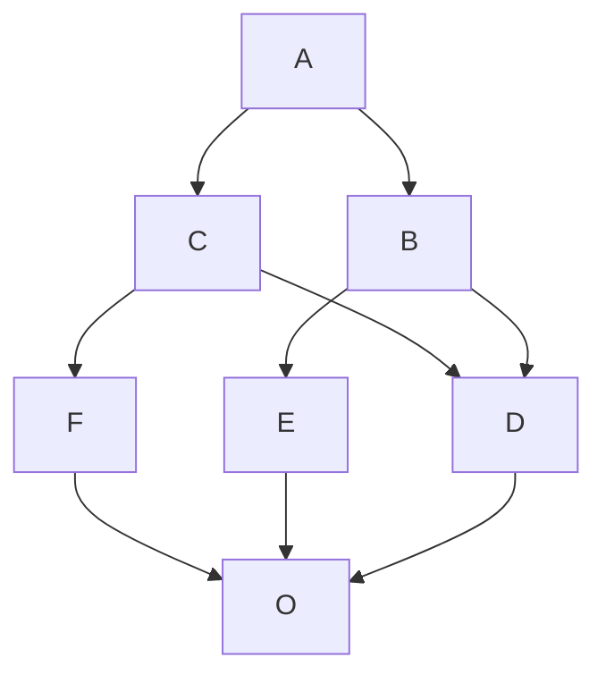
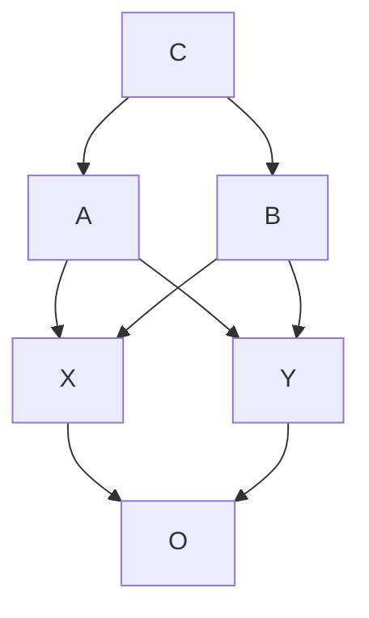

# Object-oriented programming (OOP)

Everything in Python is an object.

### Class

Class attributes are shared among all instances, while instance attributes
are not; therefore, you should use class attributes to provide the states and 
behaviors to be shared by all instances, and use instance attributes for data 
that belongs just to one specific object.

When you search for an attribute in an object, if it is not found, Python 
keeps searching in the class that was used to create that object (and keeps 
searching until it's either found or the end of the inheritance chain is 
reached)

Python class does not have a constructor but it has an initializer. It's 
called an initializer since it works on an already-created instance, and 
therefore it's called `__init__`.  It's a magic method, which is run right 
after the object is created. Python objects also have a `__new__` method, 
which is the actual constructor. In practice, it's not so common to have to 
override it though, it's a practice that is mostly used when coding 
metaclasses.

Class names are always written using `CapWords`

To check whether an object is an instance of a class, use the `isinstance` 
method. It is recommended over sheer type comparison: 
`(type(object) == Class)`.

A class is a subclass of itself.

Also, when in the code, you want to use a name that is a Python-reserved 
keyword or a built-in function or class, the convention is to add a trailing 
underscore to the name.

To check whether a class `class1` is a subclass of another class `class2`, use
the `issubclass` method, Example: `issubclass(class1, class2)`.

`super` is a function that returns a proxy object that delegates method calls 
to a parent or sibling class. 
Example:
```python
class Book:
    def __init__(self, title, publisher, pages):
        self.title = title
        self.publisher = publisher
        self.pages = pages

class Ebook(Book):
    def __init__(self, title, publisher, pages, format_):
        super().__init__(title, publisher, pages)
        # Another way to do the same thing is:
        # super(Ebook, self).__init__(title, publisher, pages)
        self.format_ = format_

ebook = Ebook('Learn Python Programming', 'Dummy Publishing', 500, 'PDF')
print(ebook.title) # Learn Python Programming
print(ebook.publisher) # Dummy Publishing
print(ebook.pages) # 500
print(ebook.format_) # PDF
```

Singleton classes are not really used as often in Python as in other 
languages. The effect of a singleton is usually better implemented as a global 
variable in a module.

When analyzing a system, objects typically represent nouns in the original
problem, while methods are normally verbs. Attributes may show up as
adjectives or more nouns. Name your classes, attributes, and methods
accordingly.

### The Method Resolution Order(MRO)

**The Method Resolution Order(MRO)** is the order in which base classes are 
searched for a member during lookup.
The list of the ancestors of a class C, including the class itself, ordered 
from the nearest ancestor to the furthest, is called the class precedence list 
or the linearization of C. C3 algorithm to compute the linearization L[C] of 
the class C is as follows: _The linearization of C is the sum of C plus the 
merge of the linearizations of the parents and the list of the parents._
In symbolic notation:
> L[C(B1 ... BN)] = C + merge(L[B1] ... L[BN], B1 ... BN)

**Computation of merge:** Take the head of the first list, i.e L[B1][0]; if this 
head is not in the tail of any of the other lists, then add it to the 
linearization of C and remove it from the lists in the merge, otherwise look at
the head of the next list and take it, if it is a good head. Then repeat the 
operation until all the class are removed or it is impossible to find good 
heads.

**Example 1:**

```python
O = object
class F(O): pass
class E(O): pass
class D(O): pass
class C(D,F): pass
class B(D,E): pass
class A(B,C): pass
```

In this case the inheritance graph can be drawn as



The linearizations of O,D,E and F are trivial:
> L[O] = O
>
> L[D] = D O
>
> L[E] = E O
>
> L[F] = F O

The linearization of B can be computed as
> L[B] = B + merge(DO, EO, DE)

We see that D is a good head, therefore we take it and we are reduced to 
compute `merge(O,EO,E)`. Now O is not a good head, since it is in the tail of 
the sequence EO. In this case the rule says that we have to skip to the next 
sequence. Then we see that E is a good head; we take it and we are reduced to 
compute `merge(O,O)` which gives O. Therefore
> L[B] =  B D E O

Using the same procedure one finds:
>L[C] = C + merge(DO,FO,DF)
>
>L[C] = C + D + merge(O,FO,F)
>
>L[C] = C + D + F + merge(O,O)
>
>L[C] = C D F O

Now we can compute:
> L[A] = A + merge(BDEO,CDFO,BC)
>
> L[A] = A + B + merge(DEO,CDFO,C)
>
> L[A] = A + B + C + merge(DEO,DFO)
>
> L[A] = A + B + C + D + merge(EO,FO)
>
> L[A] = A + B + C + D + E + merge(O,FO)
>
> L[A] = A + B + C + D + E + F + merge(O,O)
>
> L[A] = A B C D E F O

**Example 2:**

```python
O = object
class X(O): pass
class Y(O): pass
class D(O): pass
class A(X,Y): pass
class B(Y,X): pass
class C(A,B): pass
```

In this case the inheritance graph can be drawn as



The linearizations of O,X,Y,A and B are as follows:
> L[O] = 0
>
> L[X] = X O
>
> L[Y] = Y O
>
> L[A] = A X Y O
>
> L[B] = B Y X O


The linearization of C can be computed as
> L[C] = C + merge(AXYO, BYXO, AB)
>
> L[C] = C + A + merge(XYO, BYXO, B)
>
> L[C] = C + A + B + merge(XYO, YXO)

At this point we cannot merge the lists `XYO` and `YXO`, since X is in the tail
of `YXO` whereas Y is in the tail of `XYO`: therefore there are no good heads 
and the C3 algorithm stops. Python>=2.3 raises an error and refuses to create 
the class C.

To get the MRO of a class C use: `C.__mro__`

### Static methods

Static methods are methods which need to be in the namespace of the class. They
cannot access class or instance attributes. They can be invoked by class and 
instances both. To create a static method use `staticmethod` decorator on a 
method. Static methods are actually quite helpful in breaking up the logic of 
a method to improve its layout. Cannot call `super()` method

### Class methods

Class methods are methods which need to operate only on the class level and 
not on the instance level. They can access class attributes but not instance 
attributes. They can be invoked by class and instances both. They are generally
used to provide factory capability to a class. To create a class method use 
`classmethod` decorator on a method.

### Instance methods

Instance methods are methods which need to operate on the instance level. They 
can access class attributes as well as instance attributes. They can be invoked
by instances only.

### Private methods and name mangling

In python everything is public. Therefore, we rely on conventions and on a 
mechanism called **name mangling**.

- **Public** attribute -> no leading underscore in the attribute's name
- **Private** attribute -> one leading underscore in the attribute's name

Private attributes are meant to be for internal use only, they should not be
used or modified from outside.

Example:
```python
class Parent:
    def __init__(self, name):
        self._name = name

    def get_name(self):
        print('Name is {}'.format(self._name))

class Child(Parent):
    def set_new_name(self, new_name):
        self._name = new_name
        print('New name is {}'.format(self._name))


obj = Child('mickey')
obj.get_name()    # Name is mickey
obj.set_new_name('minnie')  # New name is minnie
obj.get_name()    # Name is minnie <- Unexpected behaviour
print(obj.__dict__.keys()) # dict_keys(['_name'])
```

After adding another leading underscore

```python
class Parent:
    def __init__(self, name):
        self.__name = name

    def get_name(self):
        print('Name is {}'.format(self.__name))

class Child(Parent):
    def set_new_name(self, new_name):
        self.__name = new_name
        print('New name is {}'.format(self.__name))


obj = Child('mickey')
obj.get_name()    # Name is mickey
obj.set_new_name('minnie')  # New name is minnie
obj.get_name()    # Name is mickey <- Expected behaviour
print(obj.__dict__.keys()) # dict_keys(['_Parent__name', '_Child__name'])
```

**Name mangling** means that any attribute name that has at least two leading
underscores and at most one trailing underscore, such as `__my_attr`, is
replaced with a name that includes an underscore and the class name before
the actual name, such as `_ClassName__my_attr`.

This means that when you inherit from a class, the mangling mechanism gives
your private attribute two different names in the base and child classes
so that name collision is avoided.

Every class and instance object stores
references to their attributes in a special attribute called `__dict__`.

### Property decorator

In Python, `property()` is a built-in function that creates and returns a
property object. The signature of this function is
```python
property(fget=None, fset=None, fdel=None, doc=None)
```
where, `fget` is function to get value of the attribute, `fset` is function to
set value of the attribute, `fdel` is function to delete the attribute and
`doc` is a string (like a comment). As seen from the implementation, these
function arguments are optional. So, a property object can simply be
created as follows.

When you decorate a method with `property`, you can use the name of the
method as if it were a data attribute. Because of this, it's always best to
refrain from putting logic that would take a while to complete in such
methods because, by accessing them as attributes, we are not expecting to wait.

**Example:**
```python
class PropertyTest:
    def __init__(self, test):
        self._test = test
    
    def get_test(self):
      print("Getting test var")
      return self._test
    
    def set_test(self, test):
      print(f"Setting test var to {test}")
      self._test = test
    
    def del_test(self):
      print("Deleting test var")

    test = property(get_test, set_test, del_test, "Some test variable")

obj = PropertyTest('mickey')
print(obj.__class__.test.__doc__)   # Some test variable
print(obj.test)    # Getting test var | mickey
obj.test = 'minnie' # Setting test var to minnie
del obj.test    # Deleting test var
```

A property object has three methods, `getter()`, `setter()`, and `deleter()`
to specify `fget`, `fset` and `fdel` at a later point. This means, the line

```python
test = property(get_test, set_test, del_test, "Some test variable")
```
is equivalent to
```python
test = property(doc="Some test variable")

# assign fget
test = test.getter(get_test)
# assign fset
test = test.setter(set_test)
# assign fdel
test = test.deleter(det_test)
```

### Links

- [Python MRO][python-mro]{target=_blank}
- [Magic methods][magic-methods]{target=_blank}

[python-mro]: https://www.python.org/download/releases/2.3/mro/
[magic-methods]: https://docs.python.org/3/reference/datamodel.html#basic-customization